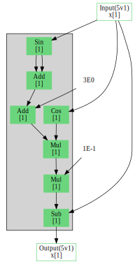

# descent

Tensor operations in Rust using Vulkan compute shaders.

## Tensor Parameters

A _parameter_ is a tensor with known shape, backed by Vulkan device memory, optionally initialized with some data.

Parameters are created via an _environment_, which wraps a Vulkan device.

```rust
let mut env = Environment::new();

let z_param = env.static_parameter([3, 1], "z");
```

## Tensor Graphs

A _scope_ can be created to keep track of expressions that read or write to parameters.

These expressions do not directly affect any of the parameters, they simply keep track of their inputs and outputs in a graph data structure.

```rust
let graph = env.build_graph(|scope| {
    let m = scope.parameter_value(&m_param);
    let x = scope.parameter_value(&x_param);
    let y = scope.parameter_value(&y_param);

    // track an expression involving m, x and y
    let z = 2.0 * m.matmul(x) + y * y + 1.0;

    scope.write_parameter_value(&z_param, z);
});
```

After all operations have been added, the scope can be built into a _graph_ that can be run on the Vulkan device.  The graph for the example above is as follows:


This graph has been built as 2 GPU compute shaders (the grey boxes above): a matrix multiply and a fused per-element shader for the remaining ops.

## Derivatives

Parameters can also be tracked with gradients, with expressions in rust essentially tracking a (value, grad) pair instead of only the value.

In this slightly higher-level API, expressions in rust generate graph operations for the value (forwards) and gradient (backwards) at the same time.  This backwards gradient is the gradient of the loss with respect to this variable, as would be computed by back-propagation for gradient descent.

This lets us build the full graph for the forwards and backwards pass in small (composable) chunks of forward-like code, with the final loss function connecting the value and grad ops into a single graph.

```rust
let graph = env.build_graph(|scope| {
    let x = scope.parameter(&x_param);
    let y = x.sin();
    let _loss = (y.square() + y * 3.0).set_loss();
    scope.write_parameter_value(&x_param, x.value() - 0.1 * x.loss_grad());
});
```

In the example above, the loss function is defined in terms of x, then we update x proportional to the grad of the loss with respect to x (as would happen during gradient descent).

Inspecting this graph, x is updated proportional to `(2*sin(x) + 3)*cos(x)` (matching the derivative of `sin^2(x) + 3*sin(x)` as expected):



## Neural Network Modules

Finally there is an optional top-level API that provides neural network building blocks, such as fully-connected layers or 2D convolutions.

This API makes it easier to build larger networks, with each layer keeping track of its own parameters.  For example, here is a network with a single hidden layer with leaky ReLU activation:

```rust
struct SingleLayer {
    fc1: Dense,
    fc2: Dense,
}

impl SingleLayer {
    fn new(env: &mut Environment) -> Self {
        let hidden_units = 300;
        Self {
            fc1: Dense::builder(28 * 28, hidden_units).build(env),
            fc2: Dense::builder(hidden_units, 10).build(env),
        }
    }
}

impl Module for SingleLayer {
    fn eval<'s>(&self, input: DualArray<'s>, ctx: &EvalContext) -> DualArray<'s> {
        // generates ops for the value (forwards) and gradient (backwards) through the layers
        input
            .flatten()
            .apply(&self.fc1, ctx)
            .leaky_relu(0.01)
            .apply(&self.fc2, ctx)
    }
}
```

## Examples

Please the follow the link in the title of each example for a more detailed README of each one.

### [array](examples/array)

Demonstrates the lowest-level API reading and writing (value-only) arrays.

### [fashion_mnist](examples/fashion_mnist)

Trains a few different network types on the [Fashion-MNIST dataset](https://github.com/zalandoresearch/fashion-mnist).  Demonstrates the use of anti-aliasing during max pooling for improved accuracy.

### [image_fit](examples/image_fit)

Overfits a few different network types to a single RGB image.  Compares ReLU with position encoding to a SIREN network.

## Dependencies

The following crates have been very useful to develop this project:

- [petgraph](https://github.com/petgraph/petgraph): used for all graph data structures
- [slotmap](https://github.com/orlp/slotmap): storage with stable keys
- [shaderc](https://github.com/google/shaderc-rs): interface to GLSL compiler to generate SPIR-V for shaders
