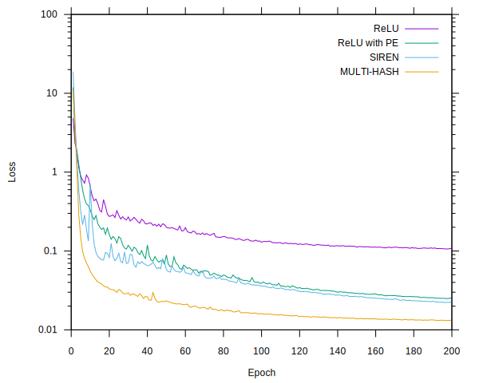

# image_fit example

This example overfits a few different networks to the following test image:

## Overview

The networks are:

- **ReLU**: 2D coordinate into a 256-128-64-32 MLP with ReLU activation after each layer
- **ReLU-PE**: 2D positional encoding (L=8 so 32 values) into the same MLP as above
- **SIREN**: 2D coordinate into a 256-128-64-32 MLP with sine activation after each layer

For all networks there is then a final linear layer to an RGB triple.

The SIREN network is implemented as described in [Implicit Neural Representations with Periodic Activation Functions](https://vsitzmann.github.io/siren/), using the initialisation scheme from the paper (including the extra scaling on the first layer).

Here are the results when training these networks on this image for 200 epochs (each epoch is after training with the same number of pixels as the input image, in batches of 16K randomly sampled pixels):

ReLU with positional encoding and SIREN are extremely close in terms of loss function, which is just L2 distance in this test.
However, due to the positional encoding increasing the input units from 2 to 32, this network has many more trainable parameters:

Network Type | Trainable Parameters
--- | ---
ReLU | 44099
ReLU with positional encoding | 51779
SIREN | 44099

## Fitted Images

Running the network to generate an image of the same resolution produces the following output after 200 epochs of training:

### ReLU

### ReLU with Positional Encoding

### SIREN

